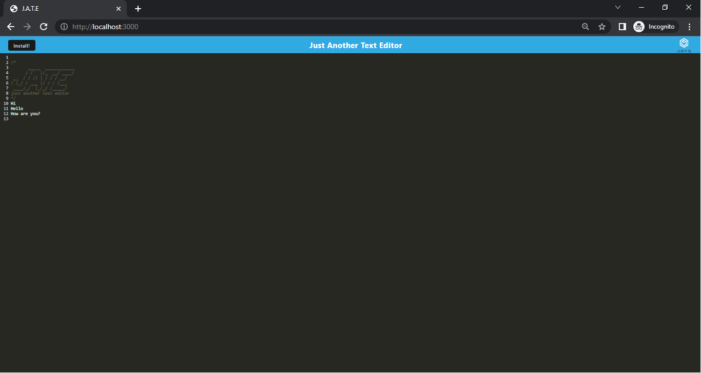

# Progressive Web Applications (PWA): Text Editor

## Description

A text editor that runs in the browser and this application is a single-page application that meets the PWA criteria. This text editor  will feature a number of data persistence techniques that serve as redundancy in case one of the options is not supported by the browser. The application will also function offline. It features a number of methods that are useful for storing and retrieving data, and is used by companies like Google and Mozilla.

## Usage

Screenshot of PWA text editor

## Links

- URL link for the deployed Github application: https://rudrijoshi.github.io/PWAtexteditor/

- URL link for the Github repository: https://github.com/rudrijoshi/PWAtexteditor/

- URL link for the heroku: https://aqueous-tor-50199-fcf338aac2bc.herokuapp.com/

